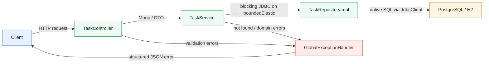

# Task Catalog

License: [MIT](LICENSE)

Russian version: [README.ru.md](README.ru.md)

REST API for task management built with Kotlin and Spring Boot.

The project supports:
- creating a task;
- listing tasks with pagination and filtering;
- getting a task by `id`;
- updating only the `status` field;
- deleting a task.

## Stack

- Kotlin
- Spring Boot WebFlux
- Project Reactor (`Mono`, `Flux`)
- Spring JDBC `JdbcClient`
- native SQL
- Flyway
- H2 for local development
- PostgreSQL for Docker-based runtime
- JUnit 5, Mockito, WebTestClient

## Architecture

Main packages:

- `controller` - HTTP layer
- `service` - business logic and Reactor API
- `repository` - database access through `JdbcClient`
- `model` - domain entities
- `dto` - request and response models
- `exception` - centralized error handling
- `config` - infrastructure configuration

The service layer returns Reactor types, while blocking JDBC calls are moved to `Schedulers.boundedElastic()` so the WebFlux event loop stays unblocked.



## Requirements

- Java 21
- Docker Desktop for containerized runtime

## Local Run

By default the app starts against in-memory H2.

```powershell
.\gradlew.bat bootRun
```

The app will be available at `http://localhost:8080`.

## Tests

```powershell
.\gradlew.bat test
```

Coverage includes:

- service unit tests
- controller slice tests
- repository integration tests on the real Flyway schema

## Docker Run With PostgreSQL

```powershell
docker compose up --build -d
```

Services:

- API: `http://localhost:8080`
- PostgreSQL: `localhost:5432`

Stop everything:

```powershell
docker compose down
```

## Configuration

Supported environment variables:

| Variable | Purpose | Default |
|---|---|---|
| `APP_PORT` | HTTP port | `8080` |
| `APP_DATASOURCE_URL` | JDBC URL | `jdbc:h2:mem:task_catalog;MODE=PostgreSQL;DB_CLOSE_DELAY=-1;DB_CLOSE_ON_EXIT=FALSE` |
| `APP_DATASOURCE_USERNAME` | Database user | `sa` |
| `APP_DATASOURCE_PASSWORD` | Database password | empty |
| `APP_DATASOURCE_DRIVER_CLASS_NAME` | JDBC driver class | `org.h2.Driver` |

When Docker Compose is used, these values are switched to PostgreSQL automatically.

## Secret Files

For local runtime, server connection, deployment, repository access, passwords, and production values, use these committed templates:

- [`test.env.local`](test.env.local)
- [`test.env.server`](test.env.server)
- [`test.env.repository`](test.env.repository)

Create the real `.env.*` files without the `test.` prefix based on these templates. The real `.env.*` files are intentionally ignored and must never be pushed with real secrets.

## API

### Create a Task

`POST /api/tasks`

```json
{
  "title": "Prepare report",
  "description": "Monthly financial report"
}
```

### List Tasks

`GET /api/tasks?page=0&size=10&status=NEW`

- `page` is required
- `size` is required
- `status` is optional
- ordering: `createdAt DESC`

### Get a Task by id

`GET /api/tasks/{id}`

### Update Status

`PATCH /api/tasks/{id}/status`

```json
{
  "status": "DONE"
}
```

### Delete a Task

`DELETE /api/tasks/{id}`

## Errors

Errors are handled centrally through `@RestControllerAdvice`.

Example response:

```json
{
  "code": "VALIDATION_ERROR",
  "message": "Request validation failed",
  "details": [
    {
      "field": "title",
      "message": "Title length must be between 3 and 100 characters"
    }
  ]
}
```

## Verified

During development we ran:

- `.\gradlew.bat test`
- Docker image build
- `docker compose up --build -d`
- live HTTP checks for `POST`, `GET`, `PATCH`, `DELETE`, and list retrieval against PostgreSQL in Docker
