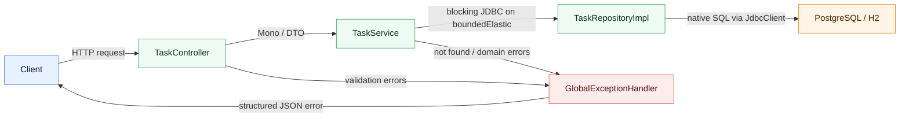

# Task Catalog

Лицензия: [MIT](LICENSE)

English version: [README.md](README.md)

REST-сервис для управления задачами на Kotlin + Spring Boot.

Проект умеет:
- создавать задачу;
- получать список задач с пагинацией и фильтрацией;
- получать задачу по `id`;
- обновлять только поле `status`;
- удалять задачу.

## Стек

- Kotlin
- Spring Boot WebFlux
- Project Reactor (`Mono`, `Flux`)
- Spring JDBC `JdbcClient`
- native SQL
- Flyway
- H2 для локального старта
- PostgreSQL для Docker-окружения
- JUnit 5, Mockito, WebTestClient

## Архитектура

Основные пакеты:

- `controller` — HTTP-слой
- `service` — бизнес-логика и Reactor API
- `repository` — работа с БД через `JdbcClient`
- `model` — доменные сущности
- `dto` — запросы и ответы API
- `exception` — централизованная обработка ошибок
- `config` — инфраструктурная конфигурация

Сервисный слой возвращает Reactor-типы, а блокирующие JDBC-вызовы выносятся на `Schedulers.boundedElastic()`, чтобы не блокировать event loop WebFlux.



## Требования

- Java 21
- Docker Desktop — для контейнерного запуска

## Локальный запуск

По умолчанию приложение стартует на H2 в памяти.

```powershell
.\gradlew.bat bootRun
```

Приложение будет доступно на `http://localhost:8080`.

## Запуск тестов

```powershell
.\gradlew.bat test
```

Покрытие включает:

- unit-тесты `service`
- slice-тесты `controller`
- интеграционные тесты `repository` на реальной Flyway-схеме

## Docker запуск с PostgreSQL

```powershell
docker compose up --build -d
```

Приложение:

- API: `http://localhost:8080`
- PostgreSQL: `localhost:5432`

Остановить окружение:

```powershell
docker compose down
```

## Конфигурация

Поддерживаются переменные окружения:

| Переменная | Назначение | Значение по умолчанию |
|---|---|---|
| `APP_PORT` | HTTP-порт приложения | `8080` |
| `APP_DATASOURCE_URL` | JDBC URL | `jdbc:h2:mem:task_catalog;MODE=PostgreSQL;DB_CLOSE_DELAY=-1;DB_CLOSE_ON_EXIT=FALSE` |
| `APP_DATASOURCE_USERNAME` | Пользователь БД | `sa` |
| `APP_DATASOURCE_PASSWORD` | Пароль БД | пусто |
| `APP_DATASOURCE_DRIVER_CLASS_NAME` | JDBC driver | `org.h2.Driver` |

Для Docker Compose эти значения автоматически переключаются на PostgreSQL.

## Файлы Секретов

Для локального запуска, подключения к серверу, деплоя, доступа к репозиторию, паролей и production-настроек используй эти шаблоны:

- [`test.env.local`](test.env.local)
- [`test.env.server`](test.env.server)
- [`test.env.repository`](test.env.repository)

По ним создай реальные `.env.*` файлы без префикса `test.`. Настоящие `.env.*` специально игнорируются git и не должны попадать в репозиторий с реальными секретами.

## API

### Создать задачу

`POST /api/tasks`

```json
{
  "title": "Prepare report",
  "description": "Monthly financial report"
}
```

### Получить список задач

`GET /api/tasks?page=0&size=10&status=NEW`

- `page` — обязателен
- `size` — обязателен
- `status` — опционален
- сортировка: `createdAt DESC`

### Получить задачу по id

`GET /api/tasks/{id}`

### Обновить статус

`PATCH /api/tasks/{id}/status`

```json
{
  "status": "DONE"
}
```

### Удалить задачу

`DELETE /api/tasks/{id}`

## Ошибки

Ошибки обрабатываются централизованно через `@RestControllerAdvice`.

Пример ответа:

```json
{
  "code": "VALIDATION_ERROR",
  "message": "Request validation failed",
  "details": [
    {
      "field": "title",
      "message": "Title length must be between 3 and 100 characters"
    }
  ]
}
```

## Что проверено

Во время разработки были выполнены:

- `.\gradlew.bat test`
- сборка Docker-образа приложения
- запуск `docker compose up --build -d`
- живые HTTP-проверки `POST`, `GET`, `PATCH`, `DELETE` и `GET` списка против PostgreSQL в контейнере
